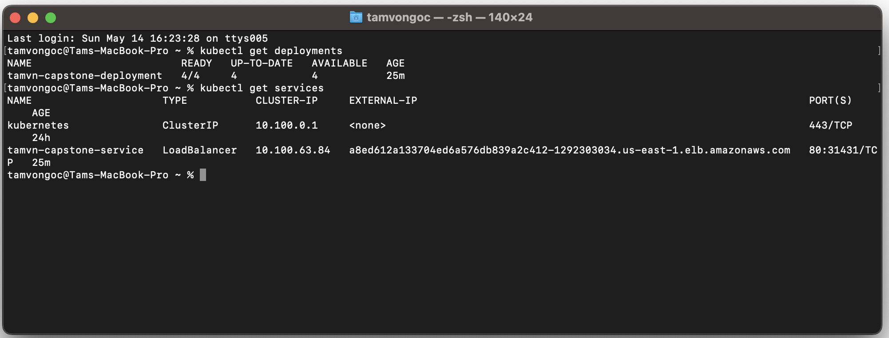
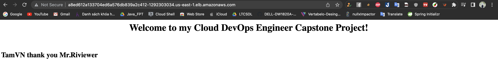

[](https://dl.circleci.com/status-badge/redirect/gh/ngoctam123/Cloud_DevOps_Engineer_Capstone/tree/main)
# Cloud DevOps Engineer Capstone Project
This project represents the successful completion of the last final Capstone project and the Cloud DevOps Engineer Nanodegree at Udacity.

## Kubectl 
After the EKS-Cluster has been successfully configured using Ansible within the CI/CD Pipeline, I checked the deployment and service as follows:
```
tamvongoc@Tams-MacBook-Pro ~ % kubectl get deployments
NAME                        READY   UP-TO-DATE   AVAILABLE   AGE
tamvn-capstone-deployment   4/4     4            4           25m
tamvongoc@Tams-MacBook-Pro ~ % kubectl get services
NAME                     TYPE           CLUSTER-IP     EXTERNAL-IP                                                               PORT(S)        AGE
kubernetes               ClusterIP      10.100.0.1     <none>                                                                    443/TCP        24h
tamvn-capstone-service   LoadBalancer   10.100.63.84   a8ed612a133704ed6a576db839a2c412-1292303034.us-east-1.elb.amazonaws.com   80:31431/TCP   25m
```


URL: a8ed612a133704ed6a576db839a2c412-1292303034.us-east-1.elb.amazonaws.com


